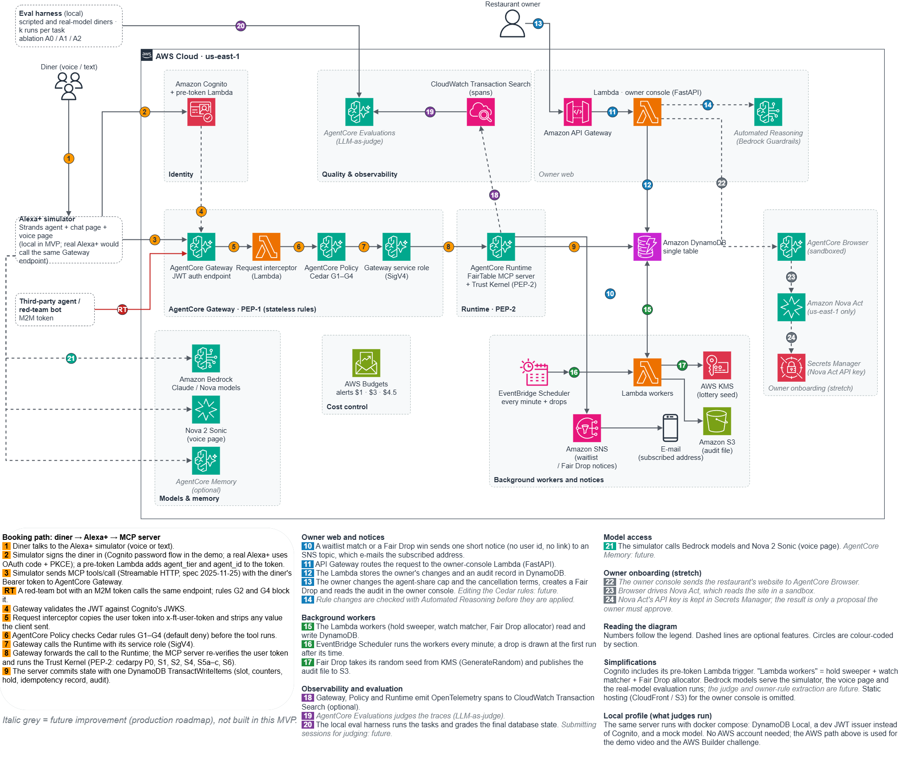

# FairTable

> Bots grab restaurant tables, and restaurants block AI agents. FairTable is the booking server a restaurant publishes for assistants such as Alexa+: every booking has a real diner and a verified agent behind it, the restaurant's own rules decide what is allowed, and hot tables are given out by a lottery anyone can check.

**Track:** Alexa+ · **Mini challenge:** AWS Builder · Amazon Developer Hackathon "Build, Ship, Shape" · [Apache-2.0](LICENSE)

## What it is
FairTable is a self-hosted **MCP server** (spec 2025-11-25, Streamable HTTP) with seven tools: `restaurant_search`, `availability_check`, `reservation_hold`, `reservation_confirm`, `reservation_manage`, `waitlist_watch`, `waitlist_status`. The tools are plain code; there is no language model inside them.

- **Verified identity.** A booking needs a signed-in diner and a verified agent. Machine clients can only read.
- **Rules the restaurant owns.** Written as Cedar policies and checked on every call: group size, active holds per diner, one table per diner and day, and the share of seats that assistants may book (the owner changes it in a console).
- **Spoken confirmation.** After a hold, the assistant reads the details back and the diner says yes. The server checks what it can: the read-back belongs to this hold and these terms, a short pause has passed, and the assistant states that the diner said yes. It cannot hear the diner, so this stops mistakes (not asking, asking too fast, confirming other terms), not an assistant that lies on purpose; the restaurant's other rules still bound the damage.
- **Fair Drop.** A hot seat is given out by a lottery with a published commitment: the secret seed is fixed first, revealed after the draw, and anyone can recompute the result.
- **Standing waitlists.** An agent registers once; a freed table is held for the diner, with no polling.
- **Measured.** A 40-task evaluation compares an open storefront with FairTable, and a 12-attack red team tries to break it (results below).

## Run it (Docker only)
The local profile is what judges run. It needs **Docker only** (Docker Compose v2, and ports 8000, 8001, 8080 and 9000 free): no AWS account and no model account.

```bash
git clone https://github.com/thphuc06/FairTable.git
cd FairTable
docker compose up --build
```

The first build downloads the base image and the Python packages and takes a few minutes. Then everything is running and seeded (three restaurants, two weeks of slots, two Fair Drops), listening on `127.0.0.1` only. Leave that terminal open (or add `-d` to run in the background). Stop with `docker compose down`; data is in memory, so every start has the same seed.

| URL | What it is |
|---|---|
| http://localhost:8080 | **Start here.** Chat with a simulated assistant, and the owner console |
| http://localhost:8000/mcp | The MCP server (identity in the `x-ft-user-token` header or `Authorization: Bearer`; OAuth metadata at `/.well-known/oauth-protected-resource`) |
| http://localhost:9000 | A development token issuer standing in for Amazon Cognito |
| http://localhost:8001 | DynamoDB Local (used by the evaluation and the database tests) |

### Try it (two minutes)
1. **Book by saying yes.** Open http://localhost:8080, sign in as `diner-alice` / `alice-dev-pass`, and type: `Book a table at Luna Trattoria for 2 tomorrow at 7pm`. The assistant holds a table and reads the details back; nothing is booked yet. Type `Yes, please` and it is booked (the server wants a pause of three seconds after the read-back; if you answer faster, say yes again). `No, thanks` books nothing.
2. **See what the server decided.** The panel beside the chat lists every tool call with the server's decision: allowed, refused by a rule (with its id), or waiting for the diner's yes. Under each answer, **N steps** shows the arguments. This shows that the checks happen in the server, not in the assistant.
3. **Change the rules.** Sign in as `owner-luna` / `luna-dev-pass` at http://localhost:8080/owner. Lower the agent share to 0 and the next booking at Luna is refused by rule S2. The owner also sets the cancellation terms, releases a seat through a Fair Drop, and reads the audit list.
4. **Call the tools yourself** with the [MCP Inspector](https://github.com/modelcontextprotocol/inspector) (transport Streamable HTTP, URL `http://localhost:8000/mcp`, header `Authorization: Bearer <token>`):

   ```bash
   curl -s -X POST http://localhost:9000/token -d grant_type=password -d client_id=alexa-plus-sim \
        -d username=diner-alice -d password=alice-dev-pass
   npx @modelcontextprotocol/inspector
   ```

   Copy the `access_token` from the answer into the header.

   `waitlist_watch` with `drop_id` enters a lottery (Sakura Counter on Fridays, `drop-sakura-<date>`). After the draw, the full record is at `fairtable://drops/<drop_id>/audit`; `fairtable://restaurants/<id>/policies` is each restaurant's rules in plain English.

5. **Check a lottery yourself.** Open `http://localhost:8080/drops/<drop_id>` (no sign-in; the owner console lists the ids). Before the draw it shows the commitment. After the draw (the first request after the drop time starts it) it shows the whole record and a **Verify this draw** button that recomputes the result in your browser; **Change one result and verify again** shows what a forged record looks like. **Find my ticket** takes the ticket code the assistant gave you (or its 64-character fingerprint) and shows where it is in the draw order and what it won; the record holds no names.

### Test accounts
Development-only credentials for the local issuer, public on purpose. Never use them anywhere else.

| Account | Role | Password |
|---|---|---|
| `diner-alice`, `diner-bob`, `diner-carol` | Diner | `alice-dev-pass`, `bob-dev-pass`, `carol-dev-pass` |
| `owner-luna` | Owner of Luna Trattoria | `luna-dev-pass` |

| OAuth client | Grant | Token carries |
|---|---|---|
| `alexa-plus-sim` (secret `alexa-sim-dev-secret`, machine use only) | password, client_credentials | `agent_tier=verified` |
| `shady-agent` | password | `agent_tier=unverified`: refused by the write rules |
| `bot-m2m` (secret `bot-m2m-dev-secret`) | client_credentials | no user, no agent tier: used by the red-team attacks |

## Does it work?
The evaluation runs the same 40 tasks against three configurations: **A0** an open storefront (no rules), **A1** FairTable, and **A2** FairTable without the voice-confirmation checks. A *violation* is damage to the restaurant or the diner, for example a booking the diner never agreed to or a Fair Drop seat taken directly.

| Assistant | Trials | Violations with FairTable (A1) | Violations without the rules (A0) |
|---|---|---|---|
| Scripted (mock), 4 runs per task | 160 | **0** | 28 (it stops none of the 48 attack trials) |
| DeepSeek flash, 2 runs | 80 | **0** | 6 |
| Claude Haiku 4.5 on Bedrock, 1 run | 40 | **0** | not run |
| Amazon Nova Lite on Bedrock, 1 run | 40 | **0** | 13 |

The 12-attack red team (a forged token, a machine client writing, a confirm without the read-back, a third hold, a Fair Drop seat taken directly, twenty simultaneous holds on one table, prompt injection, and others) is blocked 12 of 12 under A1. The scripted run validates the harness and the rules, not a real model; the real-model runs are small and each model sometimes declines to misbehave, so read them as evidence, not proof. Reports and charts: [`eval/reports/`](eval/reports/), method: [`eval/README.md`](eval/README.md).

## On AWS
The same code runs on AWS (built and tested on a real account). Each service, its role and what was measured is in [`docs/aws-integration.md`](docs/aws-integration.md). **Judges do not need AWS**; nothing here depends on AWS resources still running.



The numbers follow the legend under the picture; italic grey marks a future improvement, not built.

| Service | Role |
|---|---|
| Amazon Bedrock AgentCore **Runtime** | runs the MCP server |
| AgentCore **Gateway** and **Policy** | the front door for the agent; Cedar rules G1 to G4 again as defence in depth |
| AgentCore **Observability** (CloudWatch) | traces of the Gateway, the policy decisions and the Runtime |
| Amazon **Cognito** | sign-in for diners, owners and machine clients |
| Amazon **DynamoDB** | the single table |
| AWS **Lambda** + Amazon **API Gateway** | the owner console (opt-in, `OWNER_WEB=true`) |
| AWS **Lambda** + Amazon **EventBridge Scheduler** | every minute: release expired holds (and notify waiting diners) and draw Fair Drops that are due |
| Amazon **SNS**, Amazon **S3**, AWS **KMS** | waitlist and Fair Drop notices; a public copy of every draw record; the random seed of each draw |
| Amazon **Bedrock** | Nova 2 Sonic for the [voice page](docs/voice-demo.md); Claude Haiku 4.5 and Nova Lite in the evaluation |
| AWS Budgets, Secrets Manager, CDK | cost alerts, secrets, deployment |

```bash
export MCP_ALLOWED_HOSTS='*.lambda-microvm.*.on.aws'   # the Runtime's proxy host name; without it every call is refused with HTTP 421
python infra/aws_ctl.py up --runtime      # build the package and deploy the stacks (all options: docs/aws-integration.md)
python infra/aws_ctl.py seed              # load the demo data
python infra/aws_ctl.py status            # what exists and what can cost money
python infra/aws_ctl.py down --yes --account <last four digits of the account id>
pytest -m aws tests/aws                   # the real-AWS tests (opt-in, a few cents)
```

The scripts name the account they act on and never use a root user. Nothing account-specific is in the code; set `NOTIFY_EMAIL` to receive the notice e-mails (the address is never stored). The AgentCore parts cost money while they run, so deploy them to test or demo, then run `down`. A browser microphone demo with Nova 2 Sonic is described in [`docs/voice-demo.md`](docs/voice-demo.md).

## For developers
```bash
python -m venv .venv && . .venv/bin/activate          # Windows: .venv\Scripts\activate
pip install -c constraints.txt -e ".[dev,web,sim]"    # Python 3.12
docker compose up -d dynamodb                         # DynamoDB Local on 127.0.0.1:8001
export DDB_ENDPOINT_URL=http://localhost:8001 TABLE_NAME=fairtable
python scripts/seed.py --reset                        # create the table and load the demo data
python -m devauth                                     # token issuer, 127.0.0.1:9000   (terminal 2)
python -m server                                      # MCP server,   127.0.0.1:8000   (terminal 3)
python -m web                                         # web pages,    127.0.0.1:8080   (terminal 4)

pytest -q                                             # database tests run when DynamoDB Local is up (about 25 minutes in all)
pytest -q -m docker                                   # builds and starts the compose stack and drives it over HTTP
python -m eval --k 2 --config A0,A1,A2                # the 40 tasks
python -m eval.redteam                                # the 12 attacks
```

The chat assistant and the evaluation use `MODEL_PROVIDER=mock` (a script: no key, no cost) unless you set `MODEL_PROVIDER=deepseek` and `DEEPSEEK_API` in a `.env` file (see `.env.example`). Amazon Bedrock models are available through `MODEL_PROVIDER=bedrock` (needs AWS credentials and `BEDROCK_MODEL_ID`); real-model runs can cost real money, so read [`eval/README.md`](eval/README.md) first.

## Limits, and what comes next
- **The server cannot hear the diner.** The spoken yes is relayed and guarded, not proven.
- **Never tried with a real Alexa+.** Nobody outside Amazon can. The server was checked against Amazon's add-on requirements and the client's request format ([notes](docs/alexa-plus-addon-notes.md)); the assistant in this repo is a simulator.
- **A working prototype, not a finished service.** The three restaurants are made up. The owner console on AWS uses the demo login flow; a real service needs hosted sign-in with MFA for owners.
- **Not built:** changing the day or time of a booking (cancel and book again), onboarding a restaurant from its website (Amazon Nova Act with AgentCore Browser), AgentCore Evaluations, MCP Apps cards for screens, editing the Cedar rules from the console.

## Documentation
- Diagrams: [trust pipeline (two rule layers)](docs/diagram_image/1-trust-pipeline.png) · [Fair Drop](docs/diagram_image/2-fair-drop.png) · [evaluation](docs/diagram_image/3-evaluation-pipeline.png) · [spoken confirmation](docs/diagram_image/4-spoken-confirmation.png) · [AWS architecture](docs/diagram_image/aws-architecture.png)
- Architecture: [`docs/ARCHITECTURE.md`](docs/ARCHITECTURE.md) · decisions: [`docs/DECISIONS.md`](docs/DECISIONS.md) · working log: [`docs/devlog/`](docs/devlog/)
- AWS services and how each is used: [`docs/aws-integration.md`](docs/aws-integration.md) · product feedback: [`docs/product-feedback.md`](docs/product-feedback.md)
- Friction log (problems met with AWS and MCP tooling): [`docs/friction-log.md`](docs/friction-log.md)
- Amazon's Alexa+ add-on requirements and our deliberate differences: [`docs/alexa-plus-addon-notes.md`](docs/alexa-plus-addon-notes.md)

## Repository layout
`server/` MCP server and rule engine · `policies/` Cedar rules · `devauth/` dev token issuer · `web/` sign-in, owner console, chat and voice pages · `simulator/` simulated assistant · `eval/` evaluation and red team · `infra/` AWS deployment (CDK) · `scripts/` seed and tools · `tests/`. Each directory has its own `README.md`.

## License
[Apache-2.0](LICENSE)
