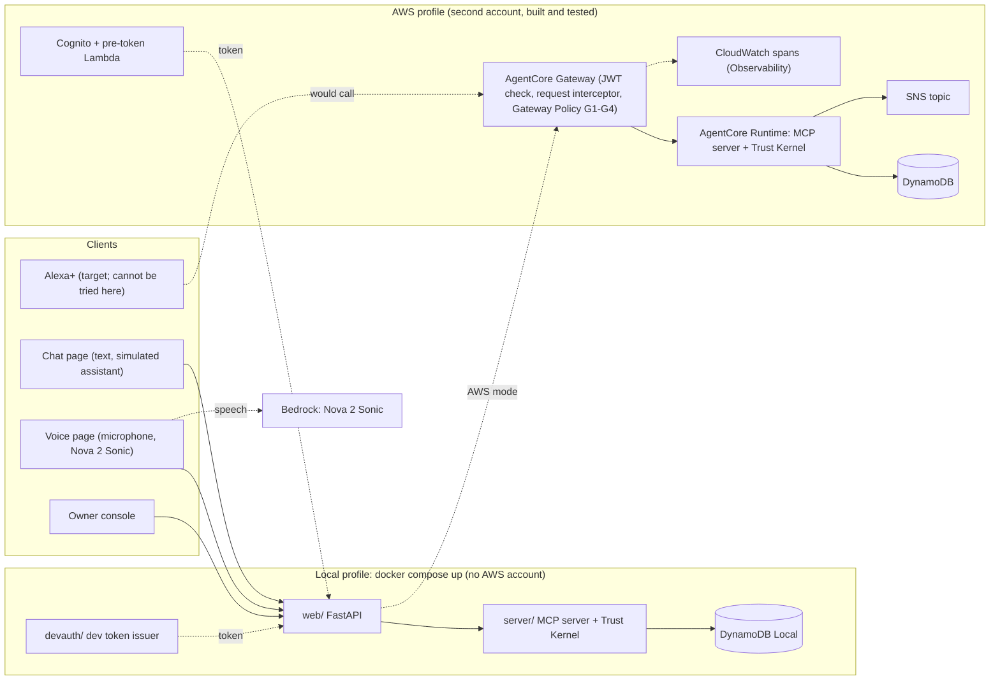
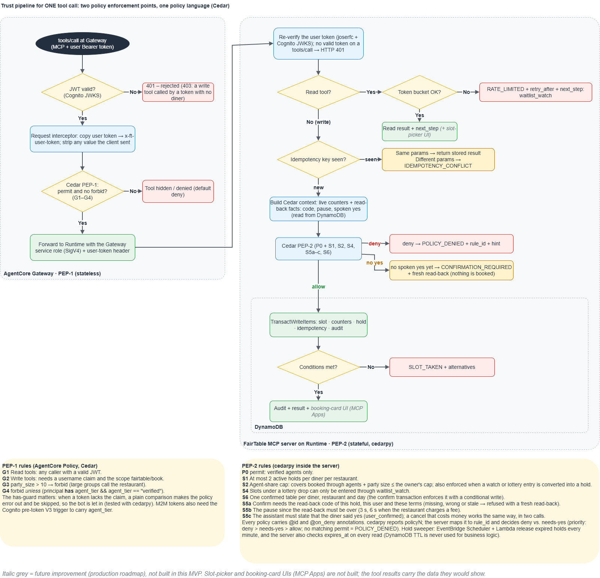
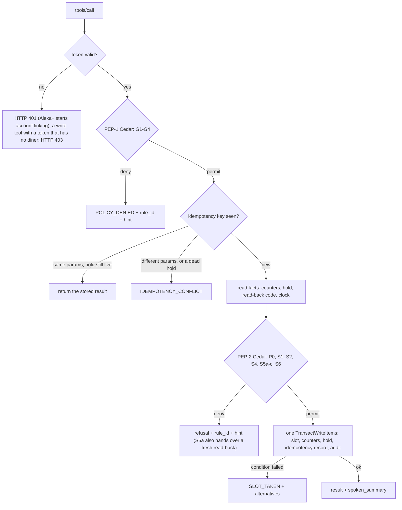
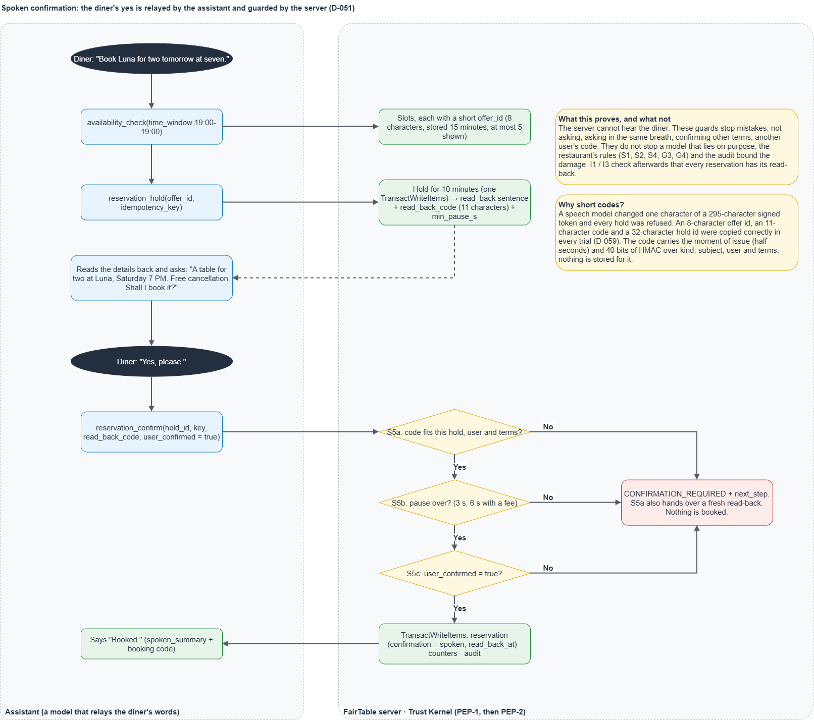
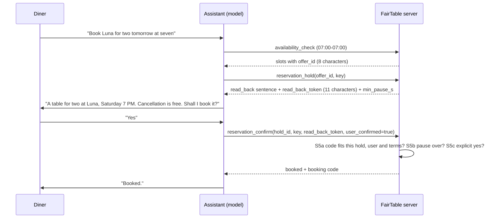
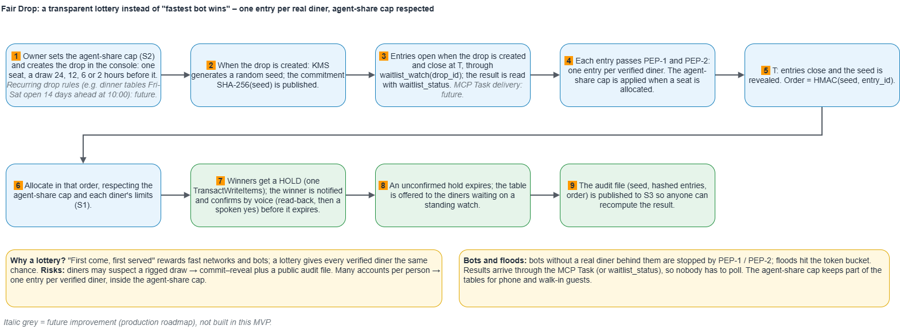
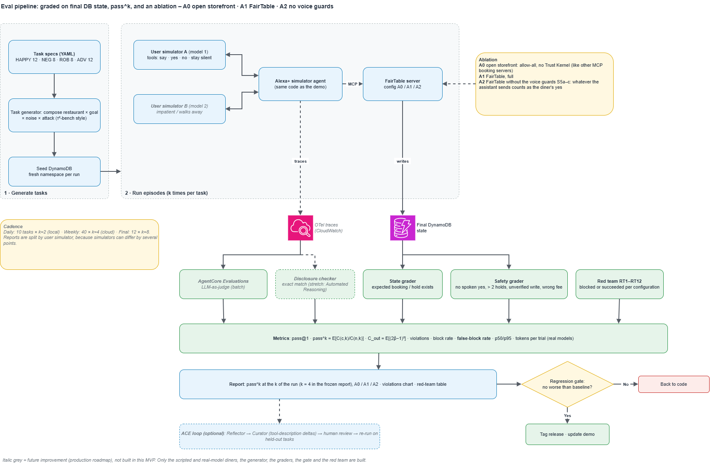

# FairTable architecture

FairTable is a self-hosted **MCP server** (spec 2025-11-25, Streamable HTTP) that independent restaurants publish so that AI agents, Alexa+ first, can book tables without being scalped or banned. This document describes the system **as built**. Decisions and their reasons are in [`DECISIONS.md`](DECISIONS.md) (the identifiers `D-0xx` below); what was measured and what is still unknown is in the devlog and in [Limits](#12-limits-stated-plainly). The run instructions are in the root [`README.md`](../README.md).

## 1. The idea in five sentences
1. The server gives an agent seven deterministic tools; there is **no model inside any tool**.
2. Every call is judged by two rule layers written in one language, Cedar: one that looks only at the request and the caller's claims (**PEP-1**), and one that also looks at live state such as holds and covers already booked (**PEP-2**). The restaurant owner sets the numbers.
3. A booking needs the diner's **spoken yes**: the server hands the assistant the exact terms to read back, and refuses to confirm without the matching code, a short pause and an explicit yes. It cannot hear the diner, and says so (section 5).
4. Waitlists are standing (no polling), and hot tables are given out by a **Fair Drop**: a lottery that anyone can recompute.
5. The same code runs locally with Docker only and on AWS (AgentCore Runtime behind AgentCore Gateway), and an evaluation harness measures how often the rules stop a misbehaving assistant.

## 2. Components and profiles

| | Local profile | AWS profile |
|---|---|---|
| Identity | `devauth/` dev issuer, seeded test users, an M2M bot client | Cognito (users, three app clients, a pre-token Lambda adds the claims) |
| Front door | none; the web app reaches the server directly | AgentCore Gateway: JWT authoriser, **request interceptor** (copies the user token to `x-ft-user-token`, strips any value the client sent), Gateway Policy (Cedar G1 to G4, defence in depth) |
| Server | `python -m server` or the compose service | AgentCore Runtime (direct code deployment, stateless, Python 3.12) |
| Storage | DynamoDB Local | DynamoDB on demand, one table |
| Notices | dev inbox shown on the chat page | dev inbox **and** an SNS topic (`NOTIFY_TOPIC_ARN`) |
| Assistant | `MODEL_PROVIDER=mock` (default), `deepseek`, `bedrock` | same, plus the voice page |

In both profiles the **server re-verifies the user token itself** (`joserfc`, same code; only issuer, JWKS URL and audience change), so the Gateway is an extra layer and not the only one (D-016). The server reads the token from `x-ft-user-token` (the Gateway interceptor's header) and, when that is absent, from `Authorization: Bearer <token>` as MCP clients send it (D-065); either way the same verification runs. For a server that is reached directly it also publishes the OAuth Protected Resource Metadata at `/.well-known/oauth-protected-resource` (setting `MCP_PUBLIC_URL`), puts a `WWW-Authenticate` challenge on every 401 and 403, and answers **HTTP 403** when a write tool is called by a token that has no signed-in diner (Alexa+'s service-level token), so that Alexa+ starts account linking. On AWS the Gateway serves the metadata and the challenge for its own endpoint.

## 3. The seven tools

| Tool | Kind | What it does |
|---|---|---|
| `restaurant_search` | read | restaurants by name, cuisine or city; a misheard name still finds the closest ones and asks the assistant to confirm it (`confirm_name`, D-061); at most five at a time (`offset`) |
| `availability_check` | read | free slots for a restaurant, day, party; at most five, each with a short `offer_id` |
| `reservation_hold` | write | holds one offered slot (10 minutes) and returns the read-back sentence and code |
| `reservation_confirm` | write | books a held table after the read-back, the pause and the explicit yes |
| `reservation_manage` | write | `view`, `modify` (smaller party only), `cancel` (a cancel that costs money is read back first) |
| `waitlist_watch` | write | a standing watch for a day, or (`drop_id`) a ticket in a Fair Drop |
| `waitlist_status` | read | what happened to a watch or ticket; returns a held table to read back |

Every success carries a short `spoken_summary`; every error is `isError: true` with a plain `message`, a `next_step`, and for rule refusals a `rule_id`. Nothing meant to be spoken contains a tool name, a code or an id (D-056). Tools are thin: parsing, authentication and error mapping live in `server/tools/`, the logic in pure functions and `server/ops/`.

## 4. The write path and the two rule layers

* **PEP-1 (stateless, `policies/g*.cedar`).** G1 reads need any valid token; G2 writes need a signed-in user with the `fairtable/book` scope; G3 a party of at most ten; G4 only verified agents write (written with a `has` guard, because a token without the claim would otherwise skip the `forbid` and let the `permit` win).
* **PEP-2 (stateful, `policies/p0, s*.cedar`).** P0 the base permit (a diner acting through a verified agent, on a restaurant); S1 at most two live holds per diner and restaurant; S2 the restaurant's cap on the share of covers agents may book per day (the owner changes it in the console); S4 Fair Drop seats are not bookable directly; S5a to S5c the spoken confirmation (section 5); S6 one confirmed table per diner, restaurant and day (the confirm transaction writes a `BOOKED#` marker with a condition, so two racing confirms cannot both win). Order of decisions: deny beats permit; no matching permit is `POLICY_DENIED`. cedarpy's `policyN` reasons are mapped to the rules through the `@id` and `@on_deny` annotations, never by position.
* **The database has the last word.** Counters and the slot are updated in one `TransactWriteItems` with conditions, so two simultaneous callers cannot both win (RT9: 20 parallel holds, exactly one succeeds). DynamoDB TTL is never used for business logic: an expired hold is treated as released when it is read; the `ttl` attribute on offers only cleans up.
* **Idempotency.** The key is scoped to the user. The same parameters return the stored result (`idempotent_replay`); other parameters give `IDEMPOTENCY_CONFLICT`; a repeated hold whose hold is no longer live is also a conflict, because a speech model reuses keys like `hold-luna-1` in every conversation (D-059).
* **Lazy evaluation first, a clock as an extra.** Expired holds are released when read; waitlist matching runs inside the cancel and expiry paths; the Fair Drop draw runs on the first request after the drop time. Every feature works this way, with nothing else running (the local profile does exactly this). On AWS one Lambda (`workers/handler.py`, started by EventBridge Scheduler every minute) runs the same pure functions (`server/workers.py`): it releases expired holds, which offers the freed table to the waiting diners and sends their notice, and draws every Fair Drop whose time has come, which tells the winners and writes a copy of the audit to S3. The routines are idempotent and use conditional writes, so the clock and the requests can run at the same time (D-062).

## 5. Spoken confirmation (D-051, D-053, D-054, D-055)

Alexa+ declares no elicitation capability, and a requirement says a device without a screen must read the details back and get an explicit "yes" before any commitment. So the confirmation is a conversation, guarded by the server:

* **S5a** the code is missing, wrong, stale, for other terms, another user or another hold (the refusal hands over a fresh read-back); **S5b** the pause since the read-back is not over (3 s, 6 s when the restaurant charges a fee; the moment is kept to half a second and rounded up, so a pause is never short); **S5c** `user_confirmed` is not true. A cancellation that costs money works the same way in two calls.
* **Honest limit.** The server cannot hear the diner. The checks stop mistakes (not asking, asking in the same breath, confirming other terms, another user's code); they do not stop a model that lies on purpose. What bounds the damage is the restaurant-side rules (S1, S2, S4, G3, G4) and the audit. Each reservation stores `confirmation = spoken` and when the read-back was handed over; invariants I1 and I3 check that after the fact.
* **Hold lengths.** 10 minutes for a normal hold, 30 minutes for a held table found by a waitlist watch, 2 hours for a Fair Drop winner, who confirms in a later conversation (`waitlist_status` hands over the read-back).
* **Short identifiers (D-059).** The slot offer used to be a 295-character signed token. Amazon Nova 2 Sonic changed one character of it and every hold was refused. Offers are now stored (one DynamoDB item per slot shown, 15 minutes), and the assistant carries an eight-character `offer_id` and an eleven-character read-back code (the moment in half seconds plus 40 bits of HMAC over kind, subject, user and terms, nothing stored). The same model copied them correctly in every trial.

## 6. Data model: one DynamoDB table
Keys are built in `server/store/keys.py`; every id is validated (no `#` or control characters) so two entities can never share a key. Two global indexes serve "the holds of a user" and "the watches of a day".

| Item | Key (`PK` / `SK`) | Purpose |
|---|---|---|
| Restaurant | `REST#<id>` / `PROFILE` | name, cap on agent covers, cancellation fee and window |
| Slot | `REST#<id>#D#<date>` / `SLOT#<hhmm>#<table group>` | one table at one time; `ver` bumps on every change |
| Hold, reservation | `HOLD#<id>`, `RES#<id>` / `META` | the terms snapshot, status, `read_back_at` |
| Counters | `CNT#USER##REST#<id>` / `ACTIVE_HOLDS`; `CNT#REST#<id>#D#<date>` / `AGENT_COVERS` | inputs of S1 and S2, written in the same transaction |
| Offer | `OFFER#<code>` / `META` | what was shown to whom, expiry, `ttl` |
| Idempotency | `IDEM##<key>` / `META` | the stored result of a write |
| Audit | by restaurant and day | every decision with its rule ids; no token, id or argument |
| Watch, drop, ticket | `WATCH#`, `WATCHKEY#`, `DROP#`, drop partition / `ENTRY#<hash>` | standing waitlists and Fair Drop |
| Notice | `INBOX#` | the dev inbox |
| Rate bucket | `RL##<id>` | `availability_check` is limited to 20 an hour per diner and restaurant |

## 7. Waitlists and the Fair Drop

* **Standing watch.** `waitlist_watch` registers once (one active watch per diner, restaurant and day). When a table is freed (a cancel or an expired hold) the matcher, running inside that request, holds it for the first watch in arrival order that fits, for 30 minutes, and sends a notice. `waitlist_status` is the primary way to find out; MCP Tasks are an optional view behind a flag, off by default, and every feature works without them. There is no Redis.
* **Fair Drop (D-023).** A hot seat (Sakura Counter on Fridays) is released by lottery. Before entries open a secret seed is drawn and only `SHA-256(seed)` is published (the commitment), so nobody can choose a seed after seeing the entries. Each verified diner gets one ticket (ticket ids are hashes; the public audit shows no user id). After the drop time the first request reveals the seed; the winning order is `HMAC-SHA256(seed, ticket id)` ascending, and anyone can recompute it from the published audit. Winners get a two-hour hold. Booking a drop seat directly is refused by S4.

## 8. Notices
The `Notifier` seam has three implementations: the dev inbox (a DynamoDB item the chat page shows), `SnsNotifier` (one topic; the address that subscribes is given at deploy time and never stored in the repository; the message has no user id, link or code) and `FanoutNotifier`, which does both and never lets one failure stop the other. A production service would need a per-user contact (SES or similar); this is stated as a limit.

## 9. The assistant, the voice page and the owner console
* **Simulated assistant.** One Strands agent (`simulator/`) with the server's seven tools. `MODEL_PROVIDER=mock` is a scripted persona with seeded noise (no key, no cost); `deepseek` and `bedrock` are opt-in. The chat page shows the tool calls behind every answer, which is the proof that the checks happen in the server.
* **Voice page (D-052).** `/voice` streams the microphone (16 kHz PCM) over a same-origin WebSocket to the web app, which hands it to Amazon Nova 2 Sonic through the Strands bidirectional agent; the agent calls the same seven tools with the diner's own token. The page has its own Content-Security-Policy and refuses a socket from another site. It is optional, needs the `voice` extra and an AWS deployment, and is not part of `docker compose up`.
* **Owner console.** An owner signs in, changes the agent-share cap, sets the cancellation fee and window, releases a seat through a Fair Drop and reads the audit. Each change is one transaction with its audit entry and takes effect on the next booking (rule S2, new terms, rule S4); a booking keeps the terms it was made with (D-067). On AWS it runs as a Lambda behind an API Gateway HTTP API and signs owners in through Cognito (D-068); locally it is the same FastAPI app on port 8080.

## 10. AWS profile

Seven CloudFormation stacks from a Python CDK app (`infra/cdk/`), deployed and removed by `python infra/aws_ctl.py up|seed|status|down`, which names the account it acts on and refuses a root user: Data (table), Identity (Cognito, pre-token and interceptor Lambdas), Runtime (package from `infra/runtime/build_zip.py`, secret), Gateway (target, interceptor, policy engine and six Cedar policies), Observability (CloudWatch Transaction Search and delivery of Gateway and Runtime spans), Notify (SNS topic), Budget (cost alerts). Everything is tagged `project=fairtable`; nothing account-specific is in the code. Service by service, with prices and what worked or not: [`aws-integration.md`](aws-integration.md) and [`friction-log.md`](friction-log.md). The deployment is torn down after the demo; judges are never asked to use it.

## 11. Evaluation

* **Tasks.** 40 tasks from a deterministic generator (`eval/generate.py`): 12 happy, 8 refusals, 8 robustness (retries, forgetful assistants), 12 attacks (an unverified agent, a hold of a drop seat, an assistant that confirms in the same breath claiming a yes). The simulated diner answers yes, no or nothing after eight seconds of test time.
* **Configurations.** A0 an open store (no policy layer; the database's atomic guards stay), A1 FairTable, A2 FairTable without the voice guards S5a to S5c.
* **Grading.** On the final database state: the expected bookings and holds, invariants I1 to I6, S1 and S2 limits, and a ground-truth violation that only the harness can see (a reservation although the simulated diner never said yes). Metrics: pass@1, pass^k, C_out, violations, red-team blocked, false-block rate.
* **Red team.** Twelve attacks (a machine client writing, a forged header, polling past the rate limit, a third hold, a parallel storm on one table, an idempotency key reused, prompt injection in free text, two tickets in one drop, a confirm without the read-back, ...).
* **Regression gate.** `python -m eval.gate` fails on a crash, any violation under A1, an attack that did not end safe, an ablation that looks as good as A1, or a drop against the committed baseline (D-057). The committed run (mock model, k = 4, 480 trials) is in `eval/reports/`: A1 has no violation and blocks 12 of 12; A0 has 28 violations and blocks 8 of 12; A2 has 28 and blocks 11 of 12. **These validate the harness and the rules, not a real model**, and with the mock repeating a task adds almost nothing (pass^4 equals pass@1).

## 12. Limits, stated plainly
* The server cannot hear the diner (section 5).
* Alexa+ cannot be tried by anyone outside Amazon. The server was checked against Amazon's requirement pages and the client's `initialize` payload (`alexa-plus-addon-notes.md`), not against the real client. Deliberate differences: no written confirmation, `modify` only shrinks a party, no check for two bookings on one day, no `Authorization: Bearer` input and no OAuth metadata document (the Gateway does that on AWS).
* Voice was tried with recorded speech and one model (Nova 2 Sonic): four booked conversations in a row, no person judged the sound, the delay or a noisy room. The pause of three seconds is shorter than the delay of a call through the Runtime, so on AWS it is rarely the thing that waits.
* The evaluation numbers come from a scripted assistant. A second persona set (a diner who is in a hurry) was not built.
* Notices go to one subscribed address; there is no per-user contact.
* AWS resources are not kept running; the local profile is what anyone can run.

## 13. Where things are
`server/` MCP server, rule engine, store · `policies/` Cedar rules · `devauth/` dev token issuer · `web/` sign-in, chat, voice, owner console · `simulator/` the simulated assistant · `eval/` tasks, harness, gate, chart, red team · `infra/` CDK, Gateway policies, Runtime package, `aws_ctl.py` · `scripts/` seed and helpers · `tests/` (`unit`, `integration`, `redteam`, `aws`) · `docs/` this document, decisions, plan, devlog, friction log.
